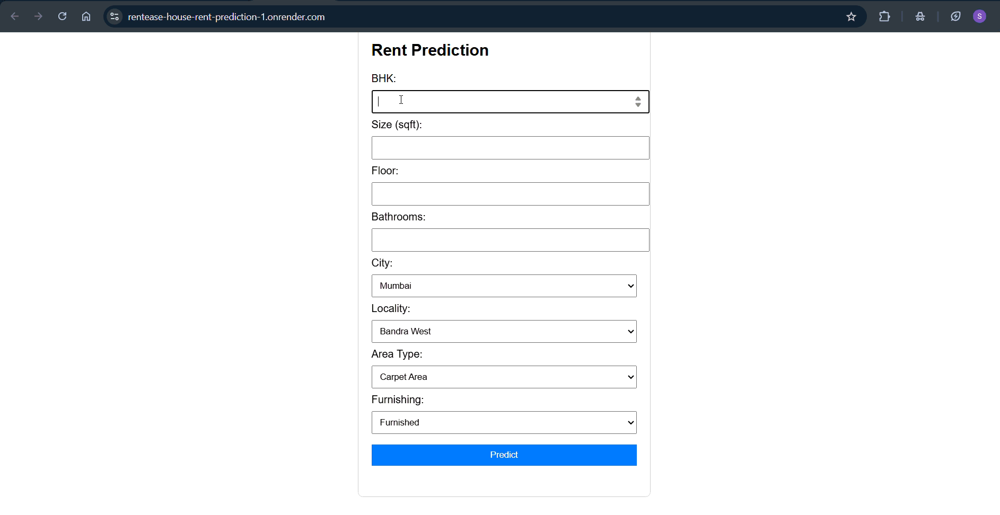

# 🏠 RentEase — Smart House Rent Prediction System

**RentEase** is an intelligent, ML-powered rent prediction system that estimates **monthly house rent** based on property and location details.  
Built with **Python, Machine Learning, Flask, and a modern HTML/CSS frontend**, RentEase helps users make realistic rental decisions with just a few inputs.

---

## 🚀 Features

### 📊 Accurate Rent Prediction
- Predicts **monthly rent (₹)** using a trained Machine Learning model  
- Handles **unseen cities and localities** gracefully  
- Prevents unrealistic low or extreme rent values  

### 🧠 Machine Learning Powered
- Trained on cleaned real-estate rental data  
- Uses **log-transformed target (`log1p` / `expm1`)** for stability  
- Encoders ensure consistent predictions across backend and frontend  

### 🌐 Web-Based Interface
- Simple and clean **HTML + CSS + JavaScript UI**
- Real-time predictions via Flask backend
- Same model works in **Jupyter Notebook & Browser**

### ⚙️ Backend API
- Flask-based REST API
- Supports JSON-based prediction requests
- CORS enabled for frontend communication

---

## 🧱 Tech Stack

### 🔹 Machine Learning
- Python  
- Pandas, NumPy  
- Scikit-learn  
- XGBoost  

### 🔹 Backend
- Flask  
- Flask-CORS  
- Pickle  

### 🔹 Frontend
- HTML  
- CSS  
- JavaScript  

---

## 🧠 Input Parameters

The model predicts rent based on:

- 📍 City  
- 🏘️ Locality  
- 🛏️ BHK  
- 📐 Size (sq ft)  
- 🏢 Floor  
- 🏗️ Total Floors  
- 🛋️ Furnishing Status  
- 🚿 Bathrooms  

---

## 📈 Output

- ✅ **Predicted Monthly Rent (₹)**
- Rounded and realistic values
- Consistent results across:
  - Jupyter Notebook
  - Browser UI
  - API response

---

## ⚙️ Installation & Setup

### 1️⃣ Clone the Repository
```bash
git clone https://github.com/SamridhiSehgal/RentEase-House-Rent-Prediction
cd RentEase-Rent-Prediction
 ```
### 2️⃣ Create Virtual Environment (Recommended)
```bash
python -m venv myenv
myenv\Scripts\activate
```
### Install Dependencies
```bash
pip install -r requirements.txt
```
### ▶️ Running the Project
```bash
python app.py
```
### ✅ Server starts at:
```bash
http://127.0.0.1:5050
```
### 🔹 Run the Frontend
-Serve frontend via Flask static files

Fill the form → Click Predict Rent → Get instant results 💸

# 📡 Backend API

### POST `/install-profile`

**Request Body**
```json
{
  "city": "Delhi",
  "locality": "Rohini",
  "bhk": 2,
  "size": 900,
  "floor": 2,
  "total_floors": 5,
  "furnishing": "Semi-Furnished",
  "bathroom": 2
}
```
**Response**
```json
{
  "predicted_rent": 18500
}
```

### 🧪 Jupyter Notebook Testing
-Load the trained model and encoder

-Apply the same preprocessing logic

-Use np.expm1() to convert predictions back to monthly rent

This ensures browser & notebook predictions match ✅
### 🎨 UI Highlights
-Minimal and beginner-friendly layout

-Clear input labels

-Instant prediction output

-Responsive design
###🙌 Acknowledgements

-Built with ❤️ using Python & Machine Learning

-Inspired by real-world rental challenges

-Developed as part of RentEase – Cloud-Based House Rental System


## 🧩 Usage


## Deploy
https://rentease-house-rent-prediction-1.onrender.com


